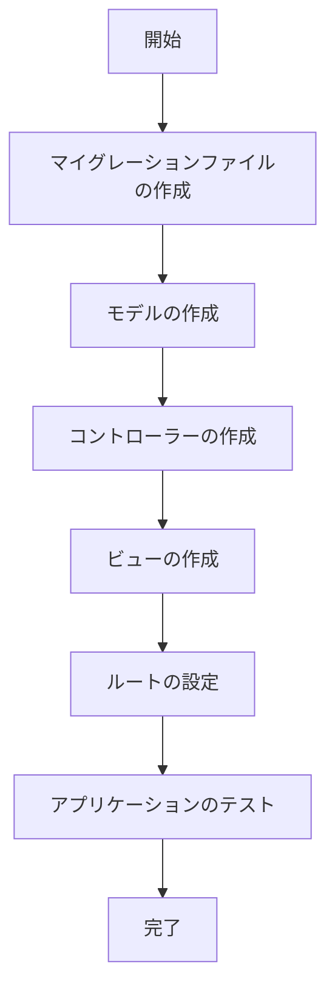

# Todoアプリ設計計画

## 1. データベース設計

Todoアイテムを保存するためのテーブルを作成します。

```
todos テーブル
- id: 主キー
- title: Todoのタイトル
- description: Todoの詳細説明（オプション）
- created_at: 作成日時
- updated_at: 更新日時
```

## 2. モデル設計

Todoアイテムを表すモデルを作成します。

```php
// App\Models\Todo.php
namespace App\Models;

use Illuminate\Database\Eloquent\Model;

class Todo extends Model
{
    protected $fillable = ['title', 'description'];
}
```

## 3. コントローラー設計

Todoアイテムの作成、表示、更新、削除を処理するコントローラーを作成します。詳細表示（show）機能は除外します。

```php
// App\Http\Controllers\TodoController.php
namespace App\Http\Controllers;

use App\Models\Todo;
use Illuminate\Http\Request;

class TodoController extends Controller
{
    // 一覧表示
    public function index()
    {
        $todos = Todo::all();
        return view('todos.index', compact('todos'));
    }

    // 作成フォーム表示
    public function create()
    {
        return view('todos.create');
    }

    // 保存処理
    public function store(Request $request)
    {
        $request->validate([
            'title' => 'required',
        ]);

        Todo::create($request->all());
        return redirect()->route('todos.index');
    }

    // 編集フォーム表示
    public function edit(Todo $todo)
    {
        return view('todos.edit', compact('todo'));
    }

    // 更新処理
    public function update(Request $request, Todo $todo)
    {
        $request->validate([
            'title' => 'required',
        ]);

        $todo->update($request->all());
        return redirect()->route('todos.index');
    }

    // 削除処理
    public function destroy(Todo $todo)
    {
        $todo->delete();
        return redirect()->route('todos.index');
    }
}
```

## 4. ビュー設計

Todoアイテムを表示し、操作するためのビューを作成します。詳細表示（show.blade.php）は除外します。

```
resources/views/todos/
- index.blade.php: 一覧表示
- create.blade.php: 作成フォーム
- edit.blade.php: 編集フォーム
```

## 5. ルート設計

Todoアプリのエンドポイントを定義するルートを設定します。詳細表示（show）ルートは除外します。

```php
// routes/web.php
use App\Http\Controllers\TodoController;

Route::get('/', function () {
    return redirect()->route('todos.index');
});

// 詳細表示（show）を除外したリソースルート
Route::resource('todos', TodoController::class)->except(['show']);
```

## 6. 実装手順

1. マイグレーションファイルの作成と実行
2. モデルの作成
3. コントローラーの作成
4. ビューの作成
5. ルートの設定
6. アプリケーションのテスト

## 実装フロー図



## データフロー図

```mermaid
graph LR
    User[ユーザー] --> |1. リクエスト| Controller[コントローラー]
    Controller --> |2. データ操作| Model[モデル]
    Model --> |3. データベース操作| DB[(データベース)]
    DB --> |4. 結果| Model
    Model --> |5. データ| Controller
    Controller --> |6. レスポンス| View[ビュー]
    View --> |7. 表示| User